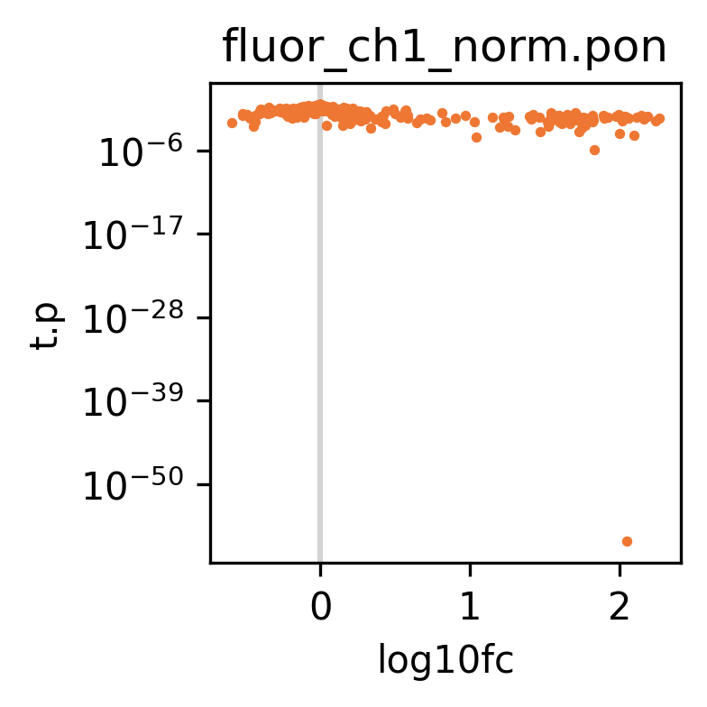
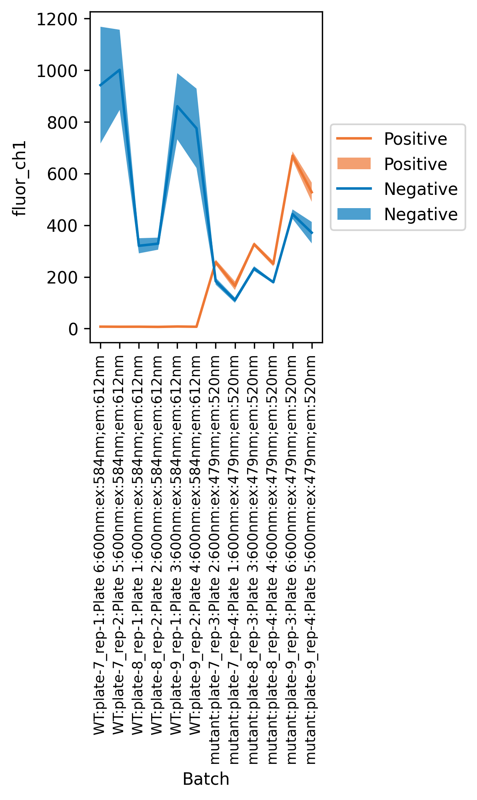
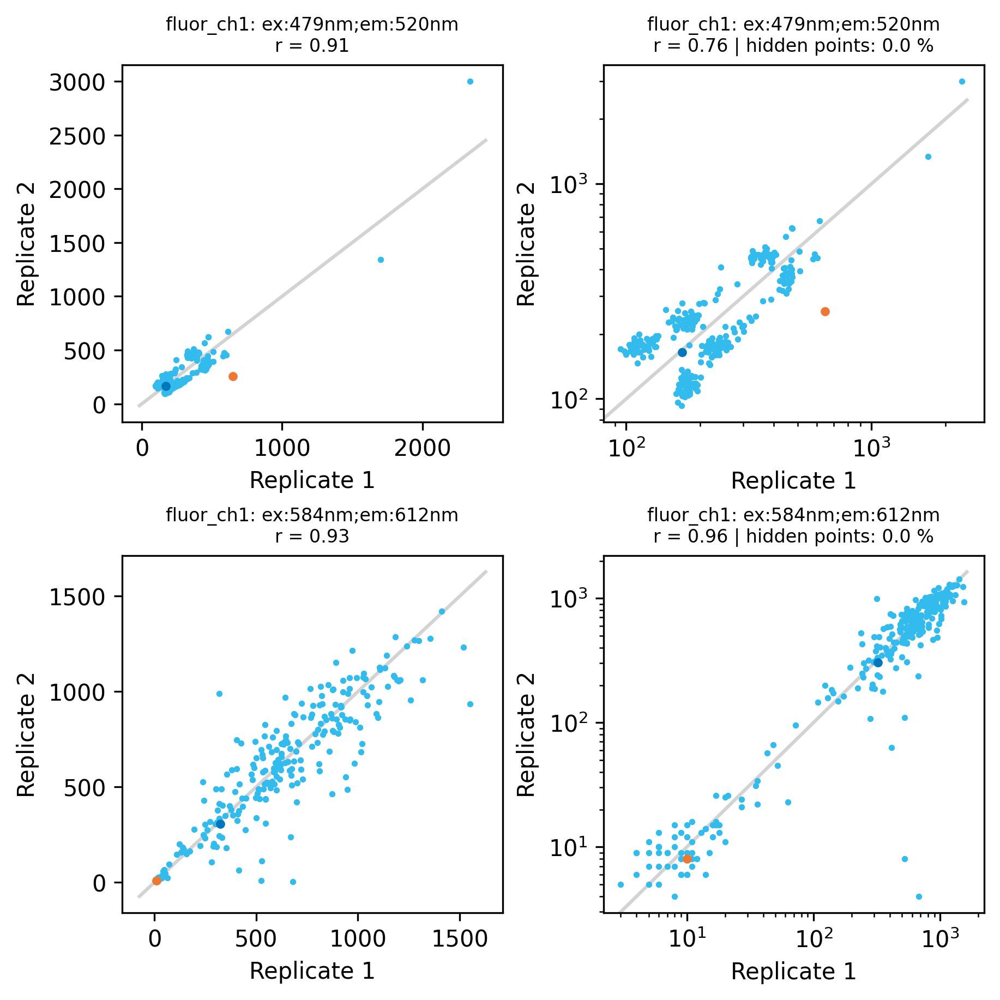

# 🏮 hts-tools


Parsing and analysing platereader absorbance and fluorescence data.

## Installation

### The easy way

Install the pre-compiled version from PyPI:

```bash
pip install hts-tools
```

### From source

Clone the repository, then `cd` into it. Then run:

```bash
pip install -e .
```

## Command-line usage

**hts-tools**  provides command-line utlities to analyse and plot data
from platereaders, starting with the _raw_ exported data with no 
manual conversion or copy-pasting needed. The tools complete specific tasks which 
can be easily composed into analysis pipelines, because the TSV table output goes to
`stdout` by default so they can be piped from one tool to another.

To get a list of commands (tools), do

```bash
hts --help
```

And to get help for a specific command, do

```bash
hts <command> --help
```

For the Python API, [see below](#python-api).

## First pipeline example

This command takes several exported Excel files (matching the pattern `plate-?.xlsx`) from a Biotek platereader, 
adds annotations on experimental conditions, and normalizes the data based on positive and negative controls. 
Finally, dose-response curves are plotted. 

```bash
hts parse plate-?.xlsx --data-shape row --vendor Biotek \
    | hts join --right layout.xlsx \
    | hts normalize --control compound_name --positive RIF --negative DMSO --grouping plate_id \
    | hts plot-dose -x concentration --facets guide_name --color compound_name \
        --output plt-test
```

### Parsing platereader exports

The command `hts parse` converts Excel or CSV or TSV files exported from platereader software from a specified vendor into a 
uniform columnar table format used by all downstream hts-tools. The `data-shape` option indicates whether the export was in plate 
format or row-wise table format. It should usually be the first command in a pipeline. 

`hts parse` produces a table with at least the following columns (with example entries):

| row_id	| column_id	| well_id	 | plate_id	| data_filename	| data_sheet       | measured_abs_ch1 | abs_ch1_wavelength |
| ------- | --------- | -------- | -------- | ------------- | ---------------- | ---------------- | ------------------ |
| A       | 1         | A01      | Plate 6  | plate-6.xlsx  | Plate6 - Sheet 1 | 0.366            | 600nm              |
| A       | 2         | A02      | Plate 6  | plate-6.xlsx  | Plate6 - Sheet 1 | 0.402	          | 600nm              |

If only fluorescence was measured, the last two columns would be called `measured_fluor_ch1` and `fluor_ch1_wavelength`. If there were multiple
measurements, then they will appear as additional columns with increasing `ch` (channel) numbers, for example,  `measured_fluor_ch2`, `fluor_ch2_wavelength`.

There will also be additional columns using information scraped from the input file. These will usually have headings starting with `meta_`,
such as `meta_protocol_file_path`, `meta_date`, `meta_time`, and `meta_reader_serial_number`.

### Adding experimental conditions

The output from `hts` parse is passed to `hts join`, which combines two tables based on values in shared columns (known as a 
database join). For example, if `layout.xlsx` contains a sheet with this table:

| column_id	| plate_id | compound_name |
| --------- | -------- | ------------- |
| 2         | Plate 6  | trimethoprim  |
| 1         | Plate 6  | moxifloxacin  |

then `hts parse plate-?.xlsx --data-shape row | hts join --right layout.xlsx` will result in 

| row_id	| column_id	| well_id	 | plate_id	| data_filename	| data_sheet       | measured_abs_ch1 | abs_ch1_wavelength | compound_name |
| ------- | --------- | -------- | -------- | ------------- | ---------------- | ---------------- | ------------------ | ------------- |
| A       | 1         | A01      | Plate 6  | plate-6.xlsx  | Plate6 - Sheet 1 | 0.366            | 600nm              | moxifloxacin  |
| A       | 2         | A02      | Plate 6  | plate-6.xlsx  | Plate6 - Sheet 1 | 0.402	          | 600nm              | trimethoprim  |

Since `column_id` and `plate_id` are the only column headings in common, the entries of these columns are used to match the rows of the 
tables. So where `column_id = 2`, `compound_name = trimethoprim` will be added. 

If you join an Excel XLSX file containing multiple sheets, these will each be joined in order. In this way, you can add experimental
conditions easily by, for example, first joining the conditions that vary by plate and row (such as compound), then by column 
(such as concentration). This approach is very flexible, and you can join on any number of columns and add any new ones you like as
long as the column headings aren't repeated. 

### Normalization within batches 

The `hts normalize` command normalizes raw measured data to be between $0$ and $1$ based on posiitve and negative controls, optionally within groups 
(or batches) of measurements. In the example above, the positive and negative controls are defined as `RIF` and `DMSO`, and 
should be found in the column `compound_name` (which may have been added by `hts join`).

The positive and negative controls are averaged within each value in the `--grouping` column. In the example above, they will 
be averaged for each `plate_id`, and these will be used to normalize the measured values of that `plate_id` according to:

$$s = \frac{m - \mu_p}{\mu_n - \mu_p}$$

where $s$ is the normalized value, $m$ is the measured value, and $\mu_p$ and $\mu_n$ are the average positive and negative controls. 

`hts normalize` adds new columns for each measured column. These columns start with `calc_` and end with `_norm`, for example `calc_abs_ch1_norm`
and `calc_abs_ch2_norm`.

### Plotting dose response

`hts plot-dose` is a very flexible command which takes the columnar tables as input and plots the data in almost any breakdown using a color-blind 
palette. The required `-x` option indicates which column to use as the x-axis (usually concentration). The y-axis will be values in all the measured 
and calculated columns (`hts plot-dr` plots them all automatically in seaparte files). The other options allow splitting the plots by file, facet 
(panel) and color according to the values in columns. 

The example above, `hts plot-dose -x concentration --facets guide_name --color compound_name`, will produce plots like this:


The panels each value with the same `guide_name` is in a `facet` (panel), and the lines are colored by `compound_name`.

## Second pipeline example

Here is another example showing the sequential use of `hts join` to join two tables of experimental data, and two other commands: `hts pivot` and 
`hts summarize`.

```bash
hts pivot compounds.xlsx \
      --name compound_name

hts parse plate-*.txt --data-shape plate \
    | hts join --right sample-sheet.csv \
    | hts join --right pivoted-compounds.tsv \
    | hts normalize --control compound_name --positive RIF --negative DMSO --grouping strain_name plate_id \
    | hts summarize --control compound_name --positive RIF --negative DMSO --grouping strain_name compound_name --plot summary \
    > summary.tsv
```

These commands are explained below.

### Converting plate shaped data to columns

Sometimes you will want to use data, such as plate layouts, which are in a plate-shaped layout instead of a column format. For example:


You can convert this to column format using `hts pivot`, which produces a table in the following format:

| row_id | column_id | compound_name | well_id | plate_id                 | filename                 |
| ------ | --------- | ------------- | ------- | ------------------------ | ------------------------ |
| C	     | 2	       | RIF	         | C02	   | Plate 7	                | compounds.xlsx           |
| D	     | 2	       | LYSINE	       | D02	   | Plate 7	                | compounds.xlsx           |
| E	     | 2	       | DMSO	         | E02	   | Plate 7	                | compounds.xlsx           |
| F	     | 2	       | RIF	         | F02	   | Plate 7	                | compounds.xlsx           |

It is assumed that there is one plate per sheet for Excel files, and one plate per file for TSV and CSV files. The
plate name is taken from the sheet name (Excel) or filename (other formats).

You can prepend the names of the `plate_id` and `filename` columns with the `-x` option. for example, 
`hts pivot compounds.xlsx -x compound_source --name compound_name` would have columns `compound_source_plate_id`
`compound_source_filename`. This is helpful when usign `hts join` later where the plate and filename 
columns would otherwise be shared but have different meanings and values, and you don't want to accidentally 
join on them.

### Statistical testing

Groups of values (such as replicates) can be compared against a negative control for statistical testing using
`hts summarize`. The `--grouping` option indicates the columns whose values together indicate values which are
replicates of a particular condition of interest. For example, `--grouping strain_name compound_name` would
indicate that values which have the same `strain_name` and `compound_name` are replicates.

Statistical tests compare to the `--negative` values, and use all measured and normalized (`calc_*_norm`) columns.
Currently, the Student's t-test and Mann-whitney U-test are implemented. The t-test is best suited to Normal-distributed
data while the MWU is better for other distributions which might not have a nice bell curve distribution.

Although `hts summarize` calcualtes both tests simultaneously, it's not a good idea to look for "significant" $p$-values 
in both. This is called p-hacking, and leads to false positives. Instead, decide which test is most appropriate for your
data and stick with that one.

This command also calculates other summary statistics such as between-replicate mean, variance, and SSMD. If a filename
prefix is provided to the `--plot` option, then volcano and flashlight plots are produced, which may be useful for identifying 
hits of high throughput screens.




## Other commands

There are several other commands from **hts-tools** which take as input the output from `hts parse`, joined
to an experimental data table (`layout.xlsx` in these examples).

- `hts qc`

Do quality cpntrol checks by calculating mean, standard deviation, Z\'-factor, and SSMD, and plotting them.

```bash
hts parse plate-?.xlsx --data-shape row  \
  | hts join --right layout.xlsx \
  | hts qc --control compound_name --positive RIF --negative DMSO --grouping strain_name plate_id --plot qc-plot \
  > qc.tsv
```




- `hts plot-hm`

Plot heatmaps of signal intensity arranged by plate well. This can be useful to identify unwanted within-plate variability.

```bash
hts parse plate-?.xlsx --data-shape row \
  | hts join --right layout.xlsx \
  | hts plot-hm --grouping strain_name sample_id plate_id --output hm
```

Here, `--grouping` identifies the columns which indicate values coming from the same plate. One file is produced per
measured and normalized (`calc_*_norm`) column.


- `hts plot-rep`

Plot two replicates against each other for each condition.

```bash
hts parse plate-?.xlsx --data-shape row  \
  | hts join --right layout.xlsx \
  | hts plot-rep --control compound_name --positive RIF --negative DMSO --grouping strain_name compound_name --output rep
```

Here, `--grouping` identifies the unique conditions within which values are treated as replicates. The positives and negatives
are plotted as different colors. One file is produced per measured and normalized (`calc_*_norm`) column.



In the plots, the left column is on a linear-linear scale and the right column is on a log-log scale. There is one row
of plots per wavelength set in the dataset.

- `hts plot-hist`

Plot histograms of the data values.

```bash
hts parse plate-?.xlsx --data-shape row \
  | hts join --right layout.xlsx \
  | hts plot-hist --control compound_name --positive RIF --negative DMSO --output hist
```

The positives and negatives are plotted as different colors. One file is produced per measured and normalized (`calc_*_norm`) column.


In the plots, the left two columns are on a linear-linear scale and the right two columns are on a log-log scale. There is one row
of plots per wavelength set in the dataset.

## Python API

**hts-tools** can be imported into Python to help make custom analyses.

```python
>>> import htstools as hts
```

You can read raw exports from platereader software into a columnar Pandas dataframe.

```python
>>> hts.from_platereader("plates.xlsx", shape="plate", vendor="Biotek")
```

Once in the columnar format, you can annotate experimental conditions.

```python
>>> import pandas as pd
>>> a = pd.DataFrame(dict(column=['A', 'B', 'A', 'B'], 
...                       abs=[.1, .2, .23, .11]))
>>> a  
    column   abs
0      A  0.10
1      B  0.20
2      A  0.23
3      B  0.11
>>> b = pd.DataFrame(dict(column=['B', 'A'], 
...                       drug=['TMP', 'RIF']))
>>> b  
    column drug
0      B  TMP
1      A  RIF
>>> shared_cols, data = join(a, b)
>>> shared_cols
('column',)
>>> data 
column   abs drug
0      A  0.10  RIF
1      A  0.23  RIF
2      B  0.20  TMP
3      B  0.11  TMP
```

If the conditions to annotate are in a plate-shaped format, you can melt them into a columnar format before joining.

```python
>>> import pandas as pd
>>> import numpy as np
>>> a = pd.DataFrame(index=list("ABCDEFGH"), 
...                  columns=range(1, 13), 
...                  data=np.arange(1, 97).reshape(8, 12))
>>> a  
    1   2   3   4   5   6   7   8   9   10  11  12
A   1   2   3   4   5   6   7   8   9  10  11  12
B  13  14  15  16  17  18  19  20  21  22  23  24
C  25  26  27  28  29  30  31  32  33  34  35  36
D  37  38  39  40  41  42  43  44  45  46  47  48
E  49  50  51  52  53  54  55  56  57  58  59  60
F  61  62  63  64  65  66  67  68  69  70  71  72
G  73  74  75  76  77  78  79  80  81  82  83  84
H  85  86  87  88  89  90  91  92  93  94  95  96
>>> pivot_plate(a, value_name="well_number")  
    row_id column_id  well_number well_id plate_id
0       A         1            1     A01         
1       B         1           13     B01         
2       C         1           25     C01         
3       D         1           37     D01         
4       E         1           49     E01         
..    ...       ...          ...     ...      ...
91      D        12           48     D12         
92      E        12           60     E12         
93      F        12           72     F12         
94      G        12           84     G12         
95      H        12           96     H12         

[96 rows x 5 columns]
```

This also works on the multi-sheet dictionary output of `pd.read_excel(..., sheet_names=None)`.

```python
>>> pivot_plate({'sheet_1': a}, value_name="well_number")    
row_id column_id  well_number well_id plate_id
0       A         1            1     A01  sheet_1
1       B         1           13     B01  sheet_1
2       C         1           25     C01  sheet_1
3       D         1           37     D01  sheet_1
4       E         1           49     E01  sheet_1
..    ...       ...          ...     ...      ...
91      D        12           48     D12  sheet_1
92      E        12           60     E12  sheet_1
93      F        12           72     F12  sheet_1
94      G        12           84     G12  sheet_1
95      H        12           96     H12  sheet_1

[96 rows x 5 columns]
```

Replicates within condition groups can be annotated.

```python
>>> import pandas as pd
>>> a = pd.DataFrame(dict(group=['g1', 'g1', 'g2', 'g2'], 
...                       control=['n', 'n', 'p', 'p'], 
...                       m_abs_ch1=[.1, .2, .9, .8], 
...                       abs_ch1_wavelength=['600nm'] * 4))
>>> a 
    group control  m_abs_ch1 abs_ch1_wavelength
0    g1       n        0.1              600nm
1    g1       n        0.2              600nm
2    g2       p        0.9              600nm
3    g2       p        0.8              600nm
>>> replicate_table(a, group='group') 
    group control  m_abs_ch1 abs_ch1_wavelength  replicate
0    g1       n        0.1              600nm          1
1    g1       n        0.2              600nm          2
2    g2       p        0.9              600nm          2
3    g2       p        0.8              600nm          1
```

If you prefer, you can get a "wide" output.

```python
>>> replicate_table(a, group='group', wide='m_abs_ch1') 
replicate  rep_1  rep_2
group                  
g1           0.2    0.1
g2           0.8    0.9
```

Values can be normalized to values between 0 and 1 relative to their positive (0%) and negative (100%) controls, optinally within groups or batches.

```python
>>> import pandas as pd
>>> a = pd.DataFrame(dict(control=['n', 'n', '', '', 'p', 'p'], 
...                  m_abs_ch1=[.1, .2, .5, .4, .9, .8], 
...                  abs_ch1_wavelength=['600nm'] * 6))
>>> a 
    control  m_abs_ch1 abs_ch1_wavelength
0       n        0.1              600nm
1       n        0.2              600nm
2                0.5              600nm
3                0.4              600nm
4       p        0.9              600nm
5       p        0.8              600nm
>>> normalize(a, control_col='control', pos='p', neg='n', measurement_col='m_abs_ch1') 
    control  m_abs_ch1 abs_ch1_wavelength  m_abs_ch1_neg_mean  m_abs_ch1_pos_mean  m_abs_ch1_norm
0       n        0.1              600nm                0.15                0.85        1.071429
1       n        0.2              600nm                0.15                0.85        0.928571
2                0.5              600nm                0.15                0.85        0.500000
3                0.4              600nm                0.15                0.85        0.642857
4       p        0.9              600nm                0.15                0.85       -0.071429
5       p        0.8              600nm                0.15                0.85        0.071429
```

The scaling can be everesed with `flip=True`.

```python
>>> normalize(a, control_col='control', pos='p', neg='n', measurement_col='m_abs_ch1', flip=True) 
    control  m_abs_ch1 abs_ch1_wavelength  m_abs_ch1_neg_mean  m_abs_ch1_pos_mean  m_abs_ch1_norm
0       n        0.1              600nm                0.15                0.85       -0.071429
1       n        0.2              600nm                0.15                0.85        0.071429
2                0.5              600nm                0.15                0.85        0.500000
3                0.4              600nm                0.15                0.85        0.357143
4       p        0.9              600nm                0.15                0.85        1.071429
5       p        0.8              600nm                0.15                0.85        0.928571
```

Summary statstics and statsitcial tests relative to the negative controls can be generated.

```python

>>> import pandas as pd
>>> a = pd.DataFrame(dict(group=['g1', 'g1', 'g2', 'g2'], 
...                       control=['n', 'n', 'p', 'p'], 
...                       m_abs_ch1=[.1, .2, .9, .8], 
...                       abs_ch1_wavelength=['600nm'] * 4))
>>> a 
    group control  m_abs_ch1 abs_ch1_wavelength
0    g1       n        0.1              600nm
1    g1       n        0.2              600nm
2    g2       p        0.9              600nm
3    g2       p        0.8              600nm
>>> summarize(a, measurement_col='m_abs_ch1', control_col='control', neg='n', group='group')
```

## Documentation

Full API documentation is at [ReadTheDocs](https://hts-tools.readthedocs.org).